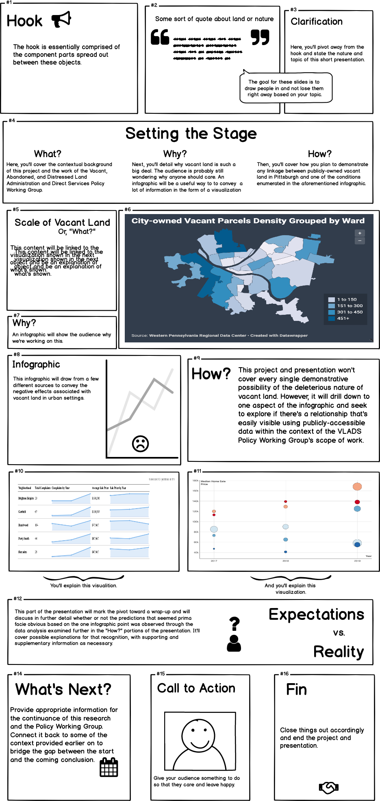

# Final Project Proposal
This page will function as the home for the component parts of my final project proposal as I work toward ultimately completing it.

## Part #1
The following passages constitute the first part of my final project proposal.

### Context of This Work
My final project for this class is connected to subject matter that I'm currently working on at my day job. One of my colleagues and I are the co-chairs of a collection of policy staffers in multiple offices that we've come to dub the Vacant, Abandoned, and Distressed Land Administration and Direct Services Policy Working Group, or the VLADS Policy Working Group for short. The goal our work thus far has been to partner with both internal and external stakeholders to offer hollistic operational and fiscal policy improvements that would better address vacant, abandoned, and distressed (VAD) land that's held by the City of Pittsburgh. For the purposes of my final project, I intend to hone in on vacant, publicly-owned land to explore some of the possible negative effects that City-owned vacant can produce, as well as touch on the need to allocate additional funding to certify this government-provided direct service as a greater priority for residents.

### This Project's Goal, Summarized
This project seeks to investigate whether there's a correlation between the number of complaint calls made to the City of Pittsburgh's 311 Service regarding publicly-owned vacant lots and the value of homes in the neighborhood and / or zip code where those empty parcels are located. It also intends to examine what relationship exists between the funding allocated by the City to maintain its vacant parcels each year, the yearly expenses logged for that activity, and aggregate complaints routed to the 311 Service for those properties, if any.

### Method and Medium
I intend to use Shorthand for this project. My cursory exposure to the platform has peaked my interest, so I'm excited to learn to use it better through this first-hand experience. More to the point, however, I feel that Shorthand is an appropriate medium for conveying the points necessary to accomplish my stated goal, as noted in the section above. The interactive combination of visualization-heavy formatting will allow me to place the graphics front and center, almost through an intentional restriction of the sheer amount of text that each slide page can contain. In doing so, I think that the main points that I'm setting out to get across are more clearly-stated, and that understanding on the part of the audience is more fluid. I'm confident that my goal can act as a guide for navigating my development of a narrative structure that is to-the-point and accessible to audience members who are unfamiliar with this topic and engaging with this subject matter for the first time.

### The Data

#### Allegheny County Property Assessments Parcel Data
I intend to use Allegheny County's [property assessment data](https://data.wprdc.org/dataset/2b3df818-601e-4f06-b150-643557229491/resource/f2b8d575-e256-4718-94ad-1e12239ddb92/download/assessments.csv), as updated for June 2019, pulled from the [Western Pennsylvania Regional Data Center (WPRDC)](http://www.wprdc.org/).

Because this dataset is incredibly large, the subset that I'll use has been narrowed down based on the following filtering criteria:

| County Building Value | Local Building Value | Sale Price | Use Description                                                           | Tax Description | Property City       |
|-----------------------|----------------------|------------|---------------------------------------------------------------------------|-----------------|---------------------|
| 0                     | 0                    | 0          | Municipal Government,  Municipal Improvement, or  Municipal Urban Renewal | Exempt          | City of  Pittsburgh |

In doing so, I'm able to ascertain that propertyies assessed at a County-level taxable value of $0, a City-level taxable value of $0, and a sale price of $0 that's documented as in use for only municipal government purposes, holds a tax-exempt status, and is located within the geographical boundaries of the City of Pittsburgh are vacant, City-owned parcels. Thus, I'm able to reduce this dataset from close to 580,000 entries to 7,000. This data subset, filtered-down using my selected criteria, is [available here](https://data.wprdc.org/dataset/property-assessments/resource/f2b8d575-e256-4718-94ad-1e12239ddb92?filters=SALEPRICE%3A0%7CPROPERTYCITY%3APITTSBURGH%7CTAXDESC%3A10+-+Exempt%7CUSEDESC%3AMUNICIPAL+GOVERNMENT%7CUSEDESC%3AMUNICIPAL+IMPROVEMENT%7CUSEDESC%3AMUNICIPAL+URBAN+RENEWAL%7CCOUNTYBUILDING%3A0%7CLOCALBUILDING%3A0).

#### Department of City Planning Vacant Parcel Inventory Data
Through my work on the VLADS Policy Working Group, I was furnished with and have access to [this dataset](https://drive.google.com/file/d/1Xt1rcSDO7CYS1dbBwaTMBH-xYqRtCEKq/view?usp=sharing) by and from the City's Department of City Planning. The file itself — which provides an accounting of all of the City's vacant properties — isn't currently hosted on a public repository, but that hyperlink will bring a user to the saved copy of the file that I uploaded to my Google Drive account, which has been made public and accessible. This dataset is formatted and coded in such a way that I don't think it'll be of the same utility to me as the Allegheny County Property Assessment Parcel Data, but I wanted to take the time to register this source of data as a potential tool for cross-checking other data on City-owned vacant parcels.

#### Citywide Revenues and Expenses
The City of Pittsburgh has published [data through the WPRDC that documents its revenues and expenses](https://data.wprdc.org/datastore/dump/f61f6e8c-7b93-4df3-9935-4937899901c7) — as allocated and subsequently spent down in accordance with its yearly Operating Budget — from FY 2012 onward. As noted on the [WPRDC's page for this data](https://data.wprdc.org/dataset/city-revenues-and-expenses):

> City Revenues and Expenses from the Operating Budget from 2012 to Present, updated every night from the City's JD Edwards ledger.

However, I'm not interested in this entire dataset, so I'll narrow my search once again. I'm able to eliminate all entries in the dataset except for those related to the Department of Finance. Using "Three Taxing Bodies Trust Fund," also known as 3TB Trust Fund, as the value for the filter "Fund Description," I have access to all revenues and expenses associated with the specific fund that the City uses to finance the maintenance of the vacant property that it owns, [which can be viewed here](https://data.wprdc.org/dataset/city-revenues-and-expenses/resource/f61f6e8c-7b93-4df3-9935-4937899901c7?filters=department_name%3ADepartment+of+Finance%7Cfund_description%3ATREE+TAXING+BODIES).  

Due to issues with the WPRDC website, though, I elected to download that dataset as a .csv file and then use Microsoft Excel's built-in filtering tool to the data to only show me results for entries marked "Maintenance" or "Landscaping" for the criteria of "Object Account Description," which indicates to a user the activity that either produced revenue for the 3TB Trust Fund or required an expenditure. I'm also able to use a similar method to find "Administrative Fees" and "Legal Fees," but it's more difficult to associate those specifically with stewardship of vacant parcels. To validate my uncertainty, I'm able to cross-reference the "Object Account Descriptions" and the "Object Account Number" with the City's Operating Budget. For example, I used the [FY 2019 Operating Budget](https://apps.pittsburghpa.gov/redtail/images/4650_2019_Operating_Budget_as_amended.pdf) when working with this dataset in the aforementioned situation. In general, yearly Operating Budgets for the City of Pittsburgh can be found on the [Office of Management and Budget's website](https://pittsburghpa.gov/omb/budgets-reports), and I intend to make use of those documents accordingly.

#### 311 Data
Once again using the WPRDC, I'm able to access data from the [City's 311 Service](https://data.wprdc.org/datastore/dump/76fda9d0-69be-4dd5-8108-0de7907fc5a4). The WPRDC [notes](https://data.wprdc.org/dataset/311-data) that this data is updated in real time, and offers the following summary:

>This data set shows 311 service requests in the City of Pittsburgh. This data is collected from the request intake software used by the 311 Response Center in the Department of Innovation & Performance. Requests are collected from phone calls, tweets, emails, a form on the City website, and through the 311 mobile application.

Because this dataset is very large and it's rather difficult to determine the accuracy of user-submitted complaints, I had to limit the scope of my filtering to that which I knew would produce reliably-accurate results. 

To that end, I proceeded to narrow down the wholesale dataset so that I was only looking at "Request Types" labeled "City Source (CDBG)," which refer to requests for work from City Source, the contractor that the City uses to maintain the vacant property that it owns in CDBG-eligible census tracts. To account for user error on the part of the general public who may mistakenly classify a request for service inaccurately, I narrowed the results down to only show those that were generated by 311 Call Center staff. These requests are entered into the system manually by City employees, which should account for a bit more accuracy. Those actions rendered [these results](https://data.wprdc.org/dataset/311-data/resource/76fda9d0-69be-4dd5-8108-0de7907fc5a4?filters=REQUEST_TYPE%3ACity+Source+(CDBG)%7CREQUEST_ORIGIN%3ACall+Center).

From there, I decided to use all of the same search criteria, but to instead only shown requests that were — [based on the dataset's data dictionary, provided by the City of Pittsburgh and 311 staff](https://data.wprdc.org/dataset/311-data/resource/d3e98904-4a86-45fb-9041-0826ab8d56d0) — classified as either "New" or "Open," meaning that they've yet to be resolved. This, in effect, means that the 311 system has yet to receive confirmation from City Source that the request has been attended to and the vacant property issue addressed for that specific request. The resulting data is [available here](https://data.wprdc.org/dataset/311-data/resource/76fda9d0-69be-4dd5-8108-0de7907fc5a4?filters=REQUEST_TYPE%3ACity+Source+(CDBG)%7CSTATUS%3A0%7CSTATUS%3A3%7CREQUEST_ORIGIN%3ACall+Center).

#### Zillow Home Value Data
Zillow publishes datasets that users are able to [access online](https://www.zillow.com/research/data/). I opted to use its data on "Median Home Value Per Sq Ft," as classified using "Neighborhood" breakdowns. Zillow produced [this dataset](http://files.zillowstatic.com/research/public/Neighborhood/Neighborhood_MedianValuePerSqft_AllHomes.csv), which I then opened using Excel. I once again made use of Excel's built-in "Filter" tool for data, and narrowed down the "Metro" category to just Pittsburgh. The "Region Name" column in that .csv file classifies neighborhoods as individual rows, and the yearly dollar value of median home value per square foot is easily observed therein.

I used nearly the exact same technique, albeit to sort the larger dataset from the "Median Home Value Per Sq Ft" using zip codes, to produce [this subset of data](http://files.zillowstatic.com/research/public/Zip/Zip_MedianValuePerSqft_AllHomes.csv) from Zillow.

## Part #2
The following passages constitute the first part of my final project proposal.

### Research Protocol

#### Target Audience
The target audience is comprised of my colleagues at City Council, with a primary focus on staff, as well as other City employees and representatives who may be involved in the later, further work that's within the scope of the VLADS Policy Working Group. Audience members will have different levels of exposure to this subject matter. 

For example, there will be individuals who have worked on this topic or comparable issues very similar to it. They'll most likely take to this presentation quickly and with ease. Others may be policy-focused wonks whose role at City Hall requires them to quickly synthesize material to which they're newly-exposed, all while formulating sufficient understanding with alacrity. They present little risk for misunderstandings, as well. Finally, the last subset of the target audience's potential membership is those who come into this with no prior exposure to this subject matter. Their unfamiliarity could lead to confusion, incorrect takeaways, questioning, or disinterest. 

Because staff represents more powerful and influential higher-ups, I, as the presenter, won't always have control over the price audience makeup. Therefore, I would do well to prepare a presentation that speaks to all three categories of the target audience, as described above.

#### Selected Representation
For obvious reasons, I chose my colleagues for the representives necessary for the coming questions. I attempted to control for the variance of exposure levels between the different subsets of the target audience by selecting the three individuals that I did for my questioning.

The first colleague chosen, hereafter referred to as Respondee #1, is my direct supervisor. They have a fair degree of policy proficiency, but isn't necessarily a policy expert. They have a wide breadth of exposure to different topics in the public policy realm and are highly-educated, so they served as a perfect representative of the second category of the target audience described in the earlier section.

Respondee #2 is a septuagenarian who works at City Council with very limited technological literacy or subject matter expertise on public policy. Because they have trouble with electronic communication, data analyzation, and arcane details of policy projects, they functioned as a stand-in for the third category of the target audience member.

The third and final person played the part of the first kind of target audience member. Respondee #3 studied urban planning in graduate school, have worked on multiple land use policy projects across various different agencies and entities, have extensive GIS and data visualization experience, and is the other individual leading the VLADS Policy Working Group with me.

#### Questions and Answers
The following questions were put to the respondees. The questions, as written-out below, constitute the script of sorts that was used for the line of questioning. However, the answers provided have been shortened and paraphrased for the purposes of brevity and clarity.

**Question #1:** On a scale of 1 to 5, with 5 being the highest, how familiar were you with the scale and density of publicly-owned properties within the geographic boundaries of the City of Pittsburgh?
**Respondee #1:** 3
**Respondee #2:** 2
**Respondee #3:** 3.5

**Question #2:** Using just a few words, list the first negative consequence that comes to mind when I raise the issue of vacant properties?
**Respondee #1:** Property re-sale values.
**Respondee #2:** Home prices.
**Respondee #3:** Neighborhood quality of life.

**Question #3:** Yes or no, does this map clearly indicate the areas in which there are great numbers of publicly-owned vacant land?
**Respondee #1:** No.
**Respondee #2:** No.
**Respondee #3:** Yes.

**Question #4:** Following the last question, can you explain your answer?
**Respondee #1:** There's no key or legend, which makes it harder to tell what the gradient means than it needs to be for me as a reader.
**Respondee #2:** The colors were confusing and don't match each other.
**Respondee #3:** The color scale could be clearer, but familiarity with data and background on subject matter helped understanding.
     
**Question #5:** Please explore this graphic using my computer. I'll ask you a question after about 30 seconds. After doing so, can you tell me what the circles represent?
**Respondee #1:** They're *not* home prices, but I can't really tell what they're supposed to refer to.
**Respondee #2:** I don't know.
**Respondee #3:** They're referencing counts of 311 tickets.

**Question #6:** Following the last question, what would make it clearer that these circles correspond to aggregate 311 complaints tied to a specific issue for the associated neighborhood in that year?
**Respondee #1:** You should add more labels or guides to make it clearer.
**Respondee #2:** It would be easier to figure it all out if the symbols were more different.
**Respondee #3:** Without an axis to guide me, I had to use the little bubble message hint about it being a complaint number to figure out that it was 311-related.

#### Findings
One of the major findings was that my visualizations weren't inherently user-friendly or intuitive, even among those who possessed some degree familiarity. For example, I approached Question #3 expecting it to be a slam dunk. It was a color-coded gradient map. I figured that I didn't need to include a key to the map for publicly-owned vacant land categorized by ward because the gradient itself would imply increasing intensity. However, even Respondee #1 had trouble easily getting a sense of the information that I was trying to convey. This, then, tells me that I should heed the advice given and incorporate a legend or key that makes clearer the intent of the graphic.

Questions #5 and #6 produced results that were helpful, albeit expected. I was worried about having trouble succinctly conveying information on an X-Y axis chart that featured a non-axis, non-labeled variable in the form of differing sizes. I think that the changes that I made to that scatter plot to better indicate differentiation in size will help — as will the expanded-upon messages that pop up when users hover over the plot points.

Another finding was that two out of the three respondents stated that property values were the first thing to pop into their minds when thinking of vacant property problems in urban neighborhoods. I'm not shocked by this, and in fact feel somewhat validated to have selected that facet of this project as a honed-in-upon part of my work.

### Wireframe
My wireframe, produced using Balsamiq, is shown below as an image file. The image has been left at a large size to permit easy reading.

